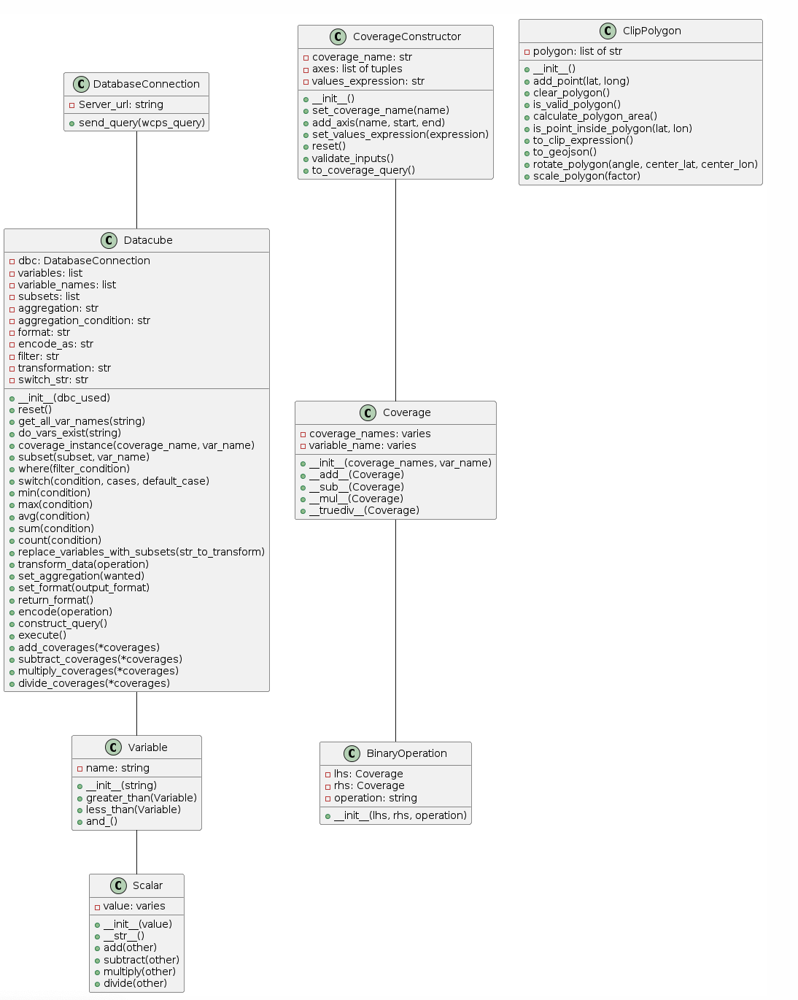

# wdc - Python Library for WCPS Data Analysis (SE group 25)

## Installation
Getting started with ‘wdc’ is straightforward:
- Begin by installing Python. For guidance, refer to [How to Install python](https://kinsta.com/knowledgebase/install-python/)
- Then, install Requests. Learn how from [How to install Requests](https://www.codecademy.com/resources/docs/python/requests-module)
- Lastly, install wdc.


### Prerequisites
| Package | Version |
| --- | --- |
| Python | 3.6 |
| Requests | 2.3 |

### Additional Components
If you plan to work in ‘jupyter notebooks’, installing ‘IPython' is necessary for image display.
[Instructions for IPython installation](https://ipython.org/install.html)

### Warnings
To suppress warnings, you can import warnings and use:
import warnings
warnings.filterwarnings("ignore")

### Testing
We used Unit tests using the Pytest framework to test.
How to use Pytest ? [Pytest](https://pypi.org/project/pytest/) <br>
First, make sure Pytest is installed in your python environment. You can do this on the terminal by executing ‘pip install pytest’. <br>
Pytest finds tests by naming convention; this means that testing files must be prefixed by ‘test_’, and all the functions inside the file must also begin with ‘test_’. <br>
To run a test inside of a directory, go to that directory, simply type ‘pytest’ and it will run all the unit tests in that directory.
Do not forget to import classes in the test file.


## Library Overview

- 'wdc' simplifies interactions with coverage datasets, commonly used in geospatial data processing and analysis. 
- It acts as a bridge for users to conduct web coverage processing service queries (WCPS), facilitating access and manipulation of geospatial coverage datasets for effective analysis.


### Understanding Coverage
Coverage is a globally recognized concept for representing various forms of raster data and datacubes, including regular and irregular grids, point clouds, and meshes.

- [Learn more about coverages](https://earthserver.eu/wcs/)

### What is WCPS?
WCPS is a high-level query language enabling users to retrieve and process geospatial data without needing to handle full datasets locally. Operations such as trimming, slicing, and applying mathematical expressions are supported.

- [Basic WCPS tutorial](https://www.youtube.com/watch?v=MnPABAAQnXM&t=1395s)
- [Advanced WCPS tutorial](https://www.youtube.com/watch?v=m1q2AIoQADs&t=1669s)


### Features *
- Developed in Python, 'wdc' facilitates various aspects of data querying. 
- 70% of the program is tested using the Pytest framework.
- Extensive library guide and documentation are available.
- Includes class diagrams in UML.
- Detailed code comments are provided.


### Included Files
- [class_documentation](/sprint_2/class_documentation.md) - Detailed class documentation for 'wdc'
- [src](/sprint_2/src/)
    - [`coverage_constructor.py`](/sprint_2/src/coverage_constructor.py)
    - [`coverage_opration.py`](/sprint_2/src/coverage_opration.py)
    - [`database_connection_object_module.py`](/sprint_2/src/database_connection_object_module.py)
    - [`datacube_basic_module.py`](/sprint_2/src/datacube_basic_module.py)
    - [`expression_builder.py`](/sprint_2/src/expression_builder.py)
    - [`wcps_clip_polygon.py`](/sprint_2/src/wcps_clip_polygon.py)
    - [`byte_to_list_module.py`](/sprint_2/src/byte_to_list_module.py)
- [test](/sprint_2/tests/)
  - [`test_database_connection.py`](/sprint_2/tests/test_database_connection.py)
  - [`test_datacube.py`](/sprint_2/tests/test_datacube.py)
  - [`test_coverage_constructor.py`](/sprint_2/tests/test_coverage_constructor.py)
  - [`test_binary.py`](/sprint_2/tests/test_binary..py)
  - [`test_clip_polygon.py`](/sprint_2/tests/test_clip_polygon.py)
  - [`test_aggregations.py`](/sprint_2/tests/test_aggregations.py)
  
  
- [image](/sprint_1/images/)
  - class_diagram

## Class Diagram


## Classes in 'wdc'
For detailed class documentation, see [here](/sprint_2/class_documentation.md)

<br/> <br/> <br/>

# Contacts (SE Sprint 3)
- [Yassine Founounou](yfounounou@constructor.university)
```

